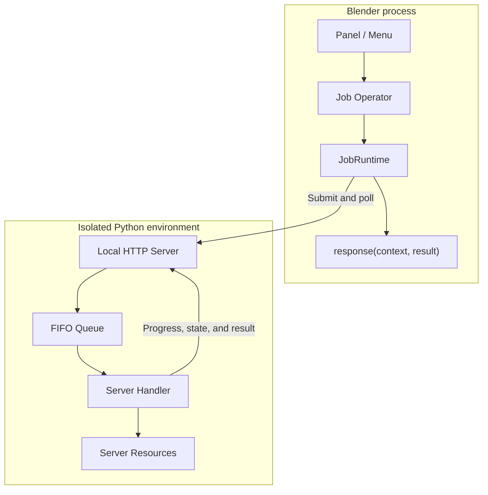

# How BlendJob Works

BlendJob separates Blender interaction from Python computation into two processes and uses `JobRuntime` to manage the complete call flow between them.

## Runtime architecture

The Blender process stays lightweight and loads the BlendJob Client plus extension UI code. The Server process loads application Handlers from the configured entrypoint and runs inside the project's isolated environment.

## One job from start to finish

1. The user runs an application Operator derived from `JobOperatorBase`.
2. The Operator's `request()` creates JSON parameters.
3. The Runtime ensures that the local Server is available and submits the job.
4. The Server immediately assigns a job ID and directory and places the job in its FIFO queue.
5. The Handler performs the work and publishes state through `context.progress()`.
6. The Runtime polls job state and updates Blender's status bar.
7. After the Handler returns, the Runtime calls `response()` on Blender's main thread.
8. `cleanup()` releases invocation-specific resources.

## Processes and lifecycle

Each Blender instance owns a Server dedicated to the extension. The Server listens on a random available `127.0.0.1` port and follows the lifetime of its Blender process. It starts on the first job submission or an explicit start action, then serves later jobs from the same process.

The Server uses a single-worker FIFO queue, so Handlers run in submission order. Long-lived models can stay in a Server Resource and be reused by many jobs.

## How data moves

Parameters from Blender to the Server are plain JSON-compatible dictionaries. Numbers, strings, booleans, lists, and dictionaries can be passed directly.

For large inputs such as images, mesh caches, or NumPy data, write a file first and submit its path. Each job receives its own `context.directory`; a Handler can write output files there and return relative names. On the Blender side, `result.file(name)` returns a path after checking its location and existence.

Keep Blender Data API reads and writes inside the Operator's `request()` and `response()`. Let Server Handlers work with regular Python data and files.

## Environment and Storage Root

The Runtime's `storage_root` is the persistent data root. BlendJob manages the isolated environment, job directories, install records, and logs there. Your project can also store models and caches under it.

The environment declaration contains a Python version, common packages, and platform packages. When the declaration changes, the Runtime uses its configuration hash to request a fresh installation, keeping deployment state aligned with project configuration.

See [Environment and Storage](environment.md) for the directory layout and installation options.
