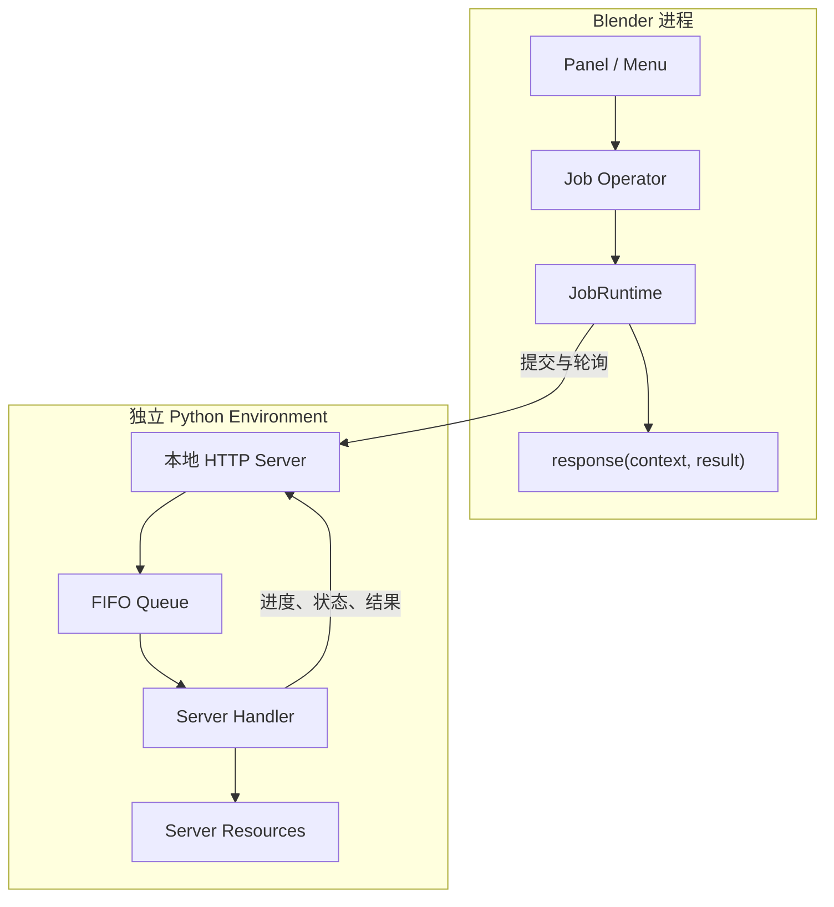

# 工作原理

BlendJob 将 Blender 交互与 Python 计算分成两个进程，并用 `JobRuntime` 管理它们之间的完整调用流程。

## 运行结构

Blender 进程保持轻量，只加载 BlendJob Client 和插件 UI 代码。Server 进程从项目的 Server 入口加载业务 Handler，并在项目声明的独立 Environment 中运行。

## 一次 Job 的流程

1. 用户执行继承自 `JobOperatorBase` 的业务 Operator。
2. Operator 的 `request()` 生成 JSON 参数。
3. Runtime 确认本地 Server 可用并提交 Job。
4. Server 立即分配 Job ID 与工作目录，并把 Job 放入 FIFO Queue。
5. Handler 执行任务，通过 `context.progress()` 发布状态。
6. Runtime 轮询状态，并更新 Blender 状态栏。
7. Handler 返回结果后，Runtime 在 Blender 主线程调用 `response()`。
8. `cleanup()` 完成这次调用的资源清理。

## 进程与生命周期

每个 Blender 实例为当前 Extension 持有一个专属 Server。Server 监听 `127.0.0.1` 的随机可用端口，并跟随 Blender 进程结束。第一次 Job 提交或显式启动时创建 Server，后续 Job 复用这个进程。

Server 使用单 Worker FIFO Queue，因此 Handler 按提交顺序运行。长生命周期模型可以保存在 Server Resource 中，在多个 Job 之间复用。

## 数据如何传递

Blender 到 Server 的参数是可由 JSON 表示的普通字典。适合直接传递数值、字符串、布尔值、列表和字典。

图片、网格缓存或 NumPy 数据等大型输入可先写入磁盘，再把路径作为参数提交。每个 Job 都有自己的 `context.directory`，Handler 可以把结果文件写入其中，并返回相对文件名。Blender 侧使用 `result.file(name)` 获得经过目录与存在性检查的路径。

Blender Data API 的读取和写入放在 Operator 的 `request()` 与 `response()` 中。Server Handler 专注于普通 Python 数据和文件。

## Environment 与 Storage Root

Runtime 的 `storage_root` 是持久数据根目录。BlendJob 在这里管理独立 Environment、Job 目录、安装记录与日志；项目也可以在其中保存模型和缓存。

Environment 声明包含 Python 版本、通用 packages 和平台 packages。声明发生变化时，Runtime 根据配置 Hash 提示重新安装，使部署状态与项目配置保持一致。

详细目录和安装方式见 [Environment 与存储](environment.md)。
