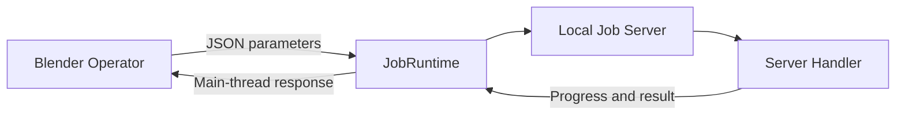

# BlendJob Developer Guide

BlendJob helps Blender extensions run long Python tasks in a dedicated process. You can keep using Blender Operators for UI and scene interaction while an isolated Python environment hosts AI, media, and scientific-computing dependencies.

## What you write

A BlendJob feature usually contains two pieces of application code:

- A Blender Operator that collects parameters and applies results on Blender's main thread
- A Server Handler that performs computation, reports progress, and writes outputs

`JobRuntime` connects them and manages environment installation, the local server, FIFO scheduling, status-bar progress, cancellation, logs, and job directories.

## Start here

For your first integration, read these guides in order:

1. [Getting Started](getting-started.md): copy a minimal extension, install its environment, and run the first job.
2. [How BlendJob Works](how-it-works.md): understand processes, environments, queues, and data flow.
3. [Blender Integration](blender-integration.md): connect real application parameters and results to an Operator.
4. [Server and Jobs](server-jobs.md): implement long tasks, output files, progress, and cancellation.

Continue with the topic guides when you need more:

- [Environment and Storage](environment.md): declare Python packages, platform packages, install sources, and data locations.
- [Server Resources](resources.md): reuse models, sessions, caches, and other long-lived objects.
- [AI Workflows](ai-workflows.md): organize model downloads, initialization, inference, and Blender result import.
- [API Reference](api.md): look up public classes and methods.

## Core objects

| Object | Process | Responsibility |
| --- | --- | --- |
| `JobRuntime` | Blender | Configure and manage the environment, server, Operators, and UI state |
| `JobOperatorBase` | Blender | Turn an application Operator into an asynchronous modal job |
| `JobServer` | Server | Register Handlers and Resources and execute jobs in order |
| `JobContext` | Server Handler | Provide progress, cancellation, job storage, and Resources |
| `JobResult` | Blender | Provide a successful value and safe access to output files |

## Choose your next step

- Run backend Python from a button: copy the layout in [Getting Started](getting-started.md).
- Connect an existing Blender Operator: read [Blender Integration](blender-integration.md).
- Use NumPy, ONNX Runtime, or PyTorch: read [Environment and Storage](environment.md).
- Download and reuse models: read [AI Workflows](ai-workflows.md).
- Expose model state or release GPU memory: read [Server Resources](resources.md).
