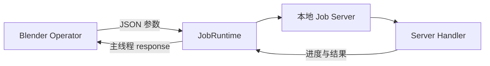

# BlendJob 开发者指南

BlendJob 帮助 Blender Extension 把耗时 Python 任务运行在独立进程中。你可以继续用 Blender Operator 构建界面与交互，同时让独立 Python Environment 承载 AI、媒体处理和科学计算依赖。

## 你需要编写什么

一个 BlendJob 功能通常只有两段业务代码：

- Blender Operator：收集参数，并在 Blender 主线程应用结果
- Server Handler：执行计算，报告进度并写出结果

`JobRuntime` 把两段代码连接起来，并管理 Environment 安装、本地 Server、FIFO Queue、状态栏进度、取消、日志与 Job 工作目录。

## 从这里开始

第一次接入 BlendJob，按以下顺序阅读：

1. [快速开始](getting-started.md)：复制一份最小 Extension，安装 Environment 并运行第一个 Job。
2. [工作原理](how-it-works.md)：了解进程、Environment、队列和数据流。
3. [Blender 集成](blender-integration.md)：把实际业务参数和结果接入 Operator。
4. [Server 与 Job](server-jobs.md)：实现耗时任务、输出文件、进度和取消。

需要扩展能力时继续阅读：

- [Environment 与存储](environment.md)：声明 Python 依赖、平台依赖、安装源和数据目录。
- [Server Resource](resources.md)：复用模型、会话、缓存等长生命周期对象。
- [AI 工作流](ai-workflows.md)：组织模型下载、初始化、推理和 Blender 结果导入。
- [API Reference](api.md)：查询公开类与方法。

## 核心对象

| 对象 | 使用位置 | 职责 |
| --- | --- | --- |
| `JobRuntime` | Blender 进程 | 配置并管理 Environment、Server、Operator 与 UI 状态 |
| `JobOperatorBase` | Blender 进程 | 将业务 Operator 变成异步 Modal Job |
| `JobServer` | Server 进程 | 注册 Handler 与 Resource，按队列执行 Job |
| `JobContext` | Server Handler | 提供进度、取消、工作目录与 Resource |
| `JobResult` | Blender 进程 | 提供成功返回值与安全的输出文件访问 |

## 选择下一步

- 让一个按钮执行后端 Python：从[快速开始](getting-started.md)复制最小结构。
- 接入已有 Blender Operator：阅读[Blender 集成](blender-integration.md)。
- 使用 NumPy、ONNX Runtime 或 PyTorch：阅读[Environment 与存储](environment.md)。
- 下载并复用模型：阅读[AI 工作流](ai-workflows.md)。
- 查询模型状态或释放显存：阅读[Server Resource](resources.md)。
